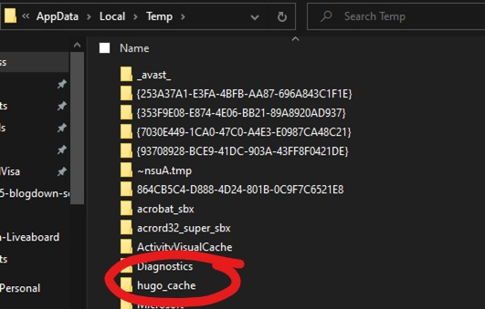

<!-- Google tag (gtag.js) -->

I set up my website about a year ago using Hugo and the Wowchemy Academic template. Overall, it has been a cool experience to put together your own website. Previously, I was paying for a Squarespace website and moving away from that was the motivating driver. It's been a journey trying to migrate old wordpress content and squarespace content into Hugo - maybe a different post.

Recently, I've been getting the same error when trying to serve my Hugo site. This is the second error that appears on the Wowchemy [Troubleshooting](https://wowchemy.com/docs/hugo-tutorials/troubleshooting/) page, "Error: failed to resolve outpute format". The fix seems to be deleting the `hugo_cache` folder in your `temp` directory. Could be '%TMP% or %TMPDIR% depending on your operating system or version. My machine is on Windows 10 Pro and a quick google found that pressing the Windows + R keys and typing in %temp% did the trick.

After deleting the `hugo_cache` folder and re-running `blogdown::serve_site()` I was able to see my website preview!

Coming back to my website to update it after a while resulted in the same issue. Seems like every time you want to serve your site you need to delete the hugo cache 😩. A better workaround seems to be to setting HUGO_CACHEDIR OS environment variable to something outside of /tmp as stated in this [post](https://discourse.gohugo.io/t/hugo-modules-for-dummies/20758/4). Without more specific directions I'm not entirely sure how to do that so that is a future problem!

Of course, right when I was happy with how the hugo/blogdown website was going, RStudio/posit released quarto. I have played around with quarto websites for my class creating [R Spatial workflows](https://catkim.quarto.pub/evb203-wk1-r-calc-area/) and found the directory structure to be much more intuitive and way less clicking through the folder structure to find what you're after. I am please with the bit of customization I've done on this hugo site though so I am holding onto it a bit longer. Another website migration is likely in my future.
