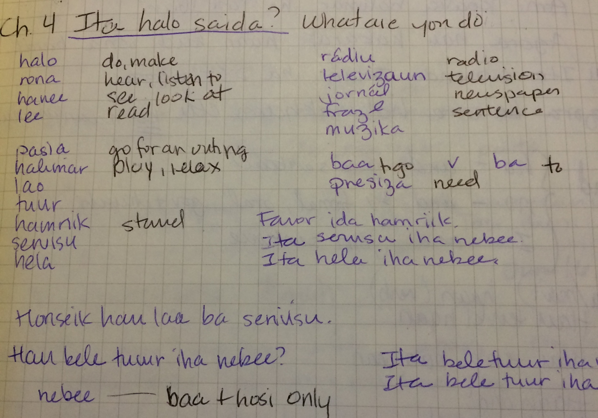

<!-- Google tag (gtag.js) -->

Bondia. Diak a lae?

My foray into Tetun, the local language of Timor-Leste. The former 27th province of Indonesia was previously a Portuguese colony for 300 years; hence, Tetun is the local language for the entire country that is heavily influenced by Portuguese. It is a creole of the different dialects spoken in the districts with Portuguese loan words. For instance, commonly used greetings are derived directly from Portuguese: bondia, botardi, bonoiti – good morning, good afternoon, and good evening. Other words are obviously from Portuguese, say ‘restaurate,’ but more slang Portuguese is not so obvious to an English speaker. For instance, “tenki” means “must” as in “Hau tenki practika Tetun” (I must practice Tetun) which is also commonly used in Portugal.

It was only a week and, in comparison to many languages, Tetun is easy to learn. There is no conjugation required for verbs, there is no verb “to be,” and the Portuguese influence means there are some recognizable words for an English speaker. However, despite these features, it is still require some intensive practice to master. One of the last days, my classmate gave me a ride and the driver was local. I quickly ran through my newly learned Tetun: Hau hosi Amerika. I hau hela Australia. Hau koalia Tetun uitoan. (Translation: I am from America and I live in Australia. I speak a little Tetun.) And after that it was back to broken words and sign language.

It was still worth it. I was the odd duck in the class as most people who study Tetun are going to be living in Timor-Leste for a year or two, not visiting for a few weeks. Even though I am far from fluent, speaking basic phrases is helpful and I feel people appreciate the effort. Some of the staff at the accommodation will try and teach me a few words here and there and I view that as-as much acceptance as I will ever deserve.
