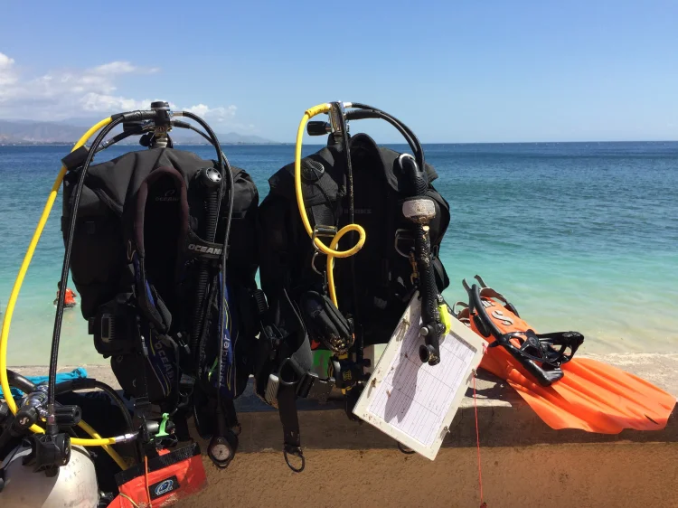

<!-- Google tag (gtag.js) -->

Sometimes field work is not so bad.

Cristo Rei is one of my four research site in Timor-Leste and also a popular beach destination. Jesus approved - see statue. On a hot day, how could you not want to get into these blue waters! In Timorese beach culture, Sunday seems to be the day everyone heads to the beach.Most people have work and school on Saturdays which leaves Sunday afternoons following church as the primary beach time. A few hundred people populated the beach on Sunday and we almost had the place to ourselves the day before.

