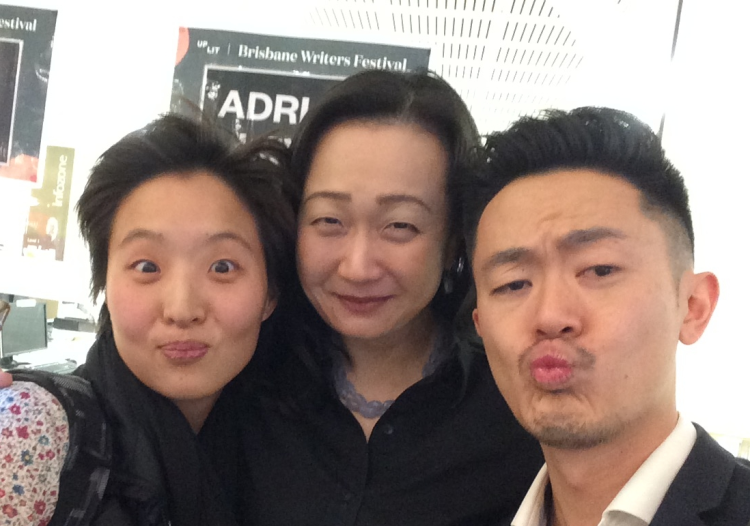

<!-- Google tag (gtag.js) -->

I have never been to a writer's festival or ever really thought about going to one. I was on the University of Queensland's (UQ) library's page to search for an article like a good student and one of the event banners scrolling through had a talk by Min Jin Lee to talk about her <em>New York Times</em> best-selling book <em>Pachinko</em>. I froze, looking at a portrait of a writer who completely reflected me, female, Korean, <em>Korean-American</em> even, and she was going to be in Brisbane.

I couldn't go to her UQ library talk, but as UQ is a principal sponsor of the Brisbane Writer's Festival I was able to score free tickets to the events.

<em>Pachinko</em>, (disclaimer: without having read it yet) is about four generations of a Korean family who move to Japan during the Japanese occupation of Korea from 1910 - 1945. Despite later characters being born in Japan for several generations, Korean-Japanese are eternally treated as foreigners. They continue to own South Korean passports, or North Korean identification cards (fun fact: Kim Jong-Un is likely a quarter Japanese...), are required to be fingerprinted yearly, and can never hold certain occupations that require citizenship such as nursing. The outright discrimination and ill-treatment cause many Korean-Japanese to hide their Korean heritage and live their lives as Japanese.

I will admit that I am only marginally familiar with Korean history and all this delve into it was fascinating - North Koreans in Japan?!?? Another part of me was in shock and awe that someone who represented me as much as possible without being related to me was sitting in an auditorium in Brisbane talking about how Korean-Americans are like friendly labrador retrievers who want to be liked and give hugs compared to regal mastiff Korean-Japanese who are always on guard from experiencing generations of discrimination. I found myself sitting there crying, realizing I had never really known how much of an outsider I have been my entire life growing-up in the States and never seen the winning combination of someone who looked like me <em>and</em> spoke like me since moving to Australia.

Needless to say, I bought the book and went up to her to sign it. The crying continued and she was the nicest, letting me go through my schpeel and gave me a hug. I even got a selfie with her and gaysian extraordinaire Benjamin Law.

It did not expect to have such an identity affirming experience going to a writer's festival. In the US, I'm a minority and in Australia I'm a novelty item. I understand as it would be jaw-dropping to run into an Asian with an Australian accent back home. And then there's science, pop culture, politics, but let's not get into all that now. One of the reasons I do science outreach is because I know none of these kids have ever seen a person like me. I often ask the students, 'Where do you think I'm from?' Invariably the first guess is China. I get where you're coming from kids, but no. One time it was followed by Taiwan, Singapore, Canada, and then the US. I have never been called Canadian more in my life... that is also another post. It was a great day of hanging out with my fellow Asians and seeing a number of great panels, #ClimateChangeisReal. My eyes have been opened and I hope to go to more writer's festivals! That is as long as I can score free tickets.

