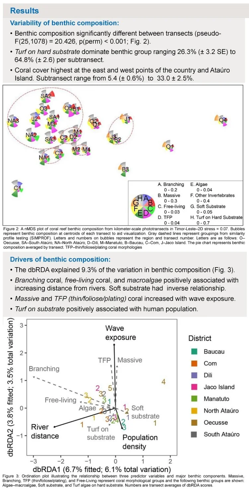
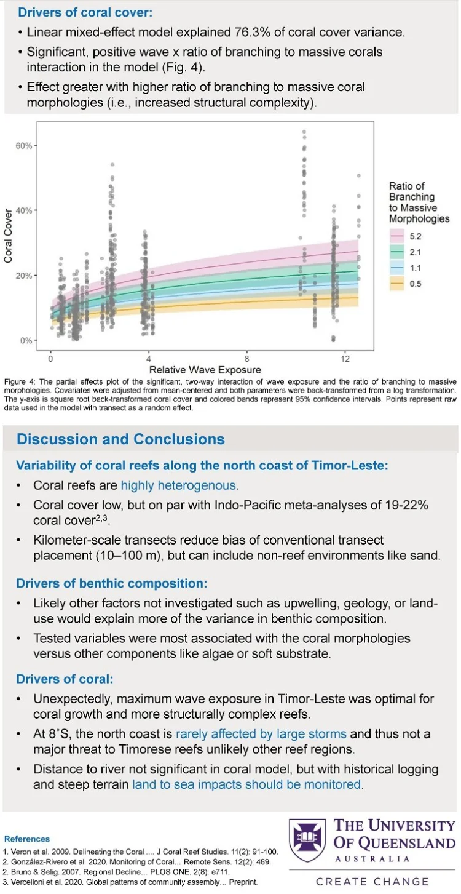

<!-- Google tag (gtag.js) -->

Poster on research on coral reefs in Timor-Leste for The University of Queensland School of Earth and Environmental Sciences graduate students research showcase! 

Virtual poster presentation <a href="https://sees.uq.edu.au/research-showcase-2020">available</a> - scroll to Catherine Kim and click the +.

Download the full poster<a href="/s/CKim_Timor_benthiccomposition_drivers_SEESposter.pdf" target="_blank"> here</a>.

