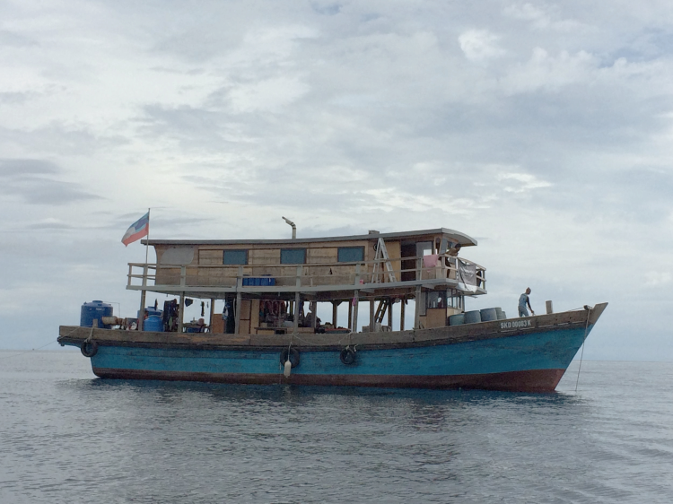
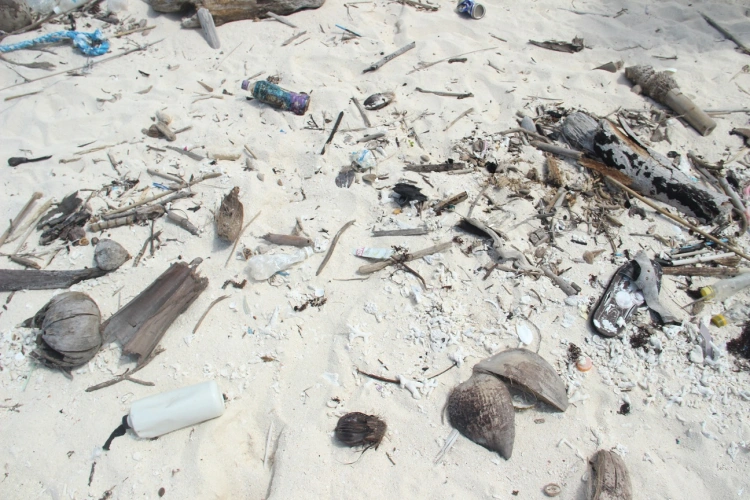

Today is World Environment Day. People often ask me how I knew I wanted to be a marine biologist. I don't really have a good answer other than I always knew I loved the ocean.

Unfortunately, there are a lot of issues facing the environment and the oceans are no exception. The list is long, depressing, and daunting it is hard to believe an individual can really make a difference in reversing some of these effects. Little things like remembering your reusable shopping bags at the store can mae a difference in our oceans. I have been tricked by plastic bags underwater. I get excited because they look like jellyfish, but upon swimming closer realize that it's plastic. I make and effort to reduce my plastic waste - I use a reusable water bottle, I bring a mug with me to get coffee, I attempt to not get straws when ordering drinks - but I am still guilty of generating plastic waste. Last month, I was on a field trip surveying the reefs of Tun Mustapha Park off the north coast of Sabah in Malaysian Borneo with WWF Malaysia. It was a very local trip. Case and point our boat:

On a boat, you are living are living in a mesocosm of the world: limited space and limited resources. Generally, tourist liveaboard boats have reverse osmosis systems or water coolers for drinking. We had 1700 gallons of fresh water on the boat and which was used by 20 people in about 5 days, partly because we used the freshwater to flush the toilets... The two blue containers at the back of the boat were added halfway through the trip because we were using the fresh water too quickly. That did not even include the drinking water. We had boxes and boxes of bottled water that were our only source of potable water. Culturally, drinking bottled water seemed to be the norm in Malaysia. The tap water seemed perfectly potable though and to my surprise, most of the bottled water was only bottled tap water! I never buy bottled water; even when traveling I make a concerted effort to avoid bottled water. Faced with a very basic boat though, I was at a loss. I accepted that it was okay because there was no other way. Steaming out of Kudat, it was a beautiful day. The sun shining high in the sky, billowy luminescent clouds shining all around, the ocean breeze hitting your face, and then a current of plastic bottles gliding back to town. It was stunning. This boat had arguably the most conservation minded people in the region aboard and yet we were contributing as much to the problem as everyone else. It bothered me, yet I was reliant on the bottled water like everyone on the boat.

What is a marine biologist to do? In these cases, I try to think of what people, society did before the invention of X technology. How did ships carry freshwater with them pre-plastic? It must have been barrels..? If the water got dirty there really is no other choice when stuck in a salt water dessert. There can always be improvement. In planning field work where I know we might rely soley on bottled water for drinking, planning ahead and asking whether there are other solutions to supplying enough drinking water for a trip would be worth the trouble for my conscience. In the case above, I imagine we could have brought a water cooler with the five gallon jugs which would have been much less waste than the 1.5 liter bottles. It would be more work, but all I have to do is close my eyes and picture the stream of glinting plastic water bottles gliding across the water toward me and the effort would be worth it.
