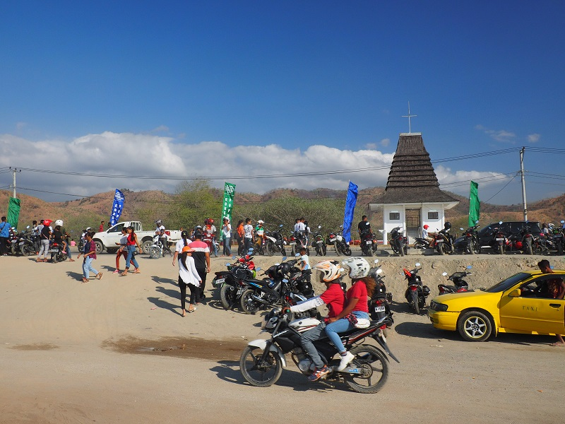
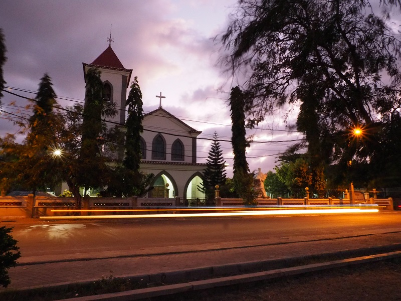
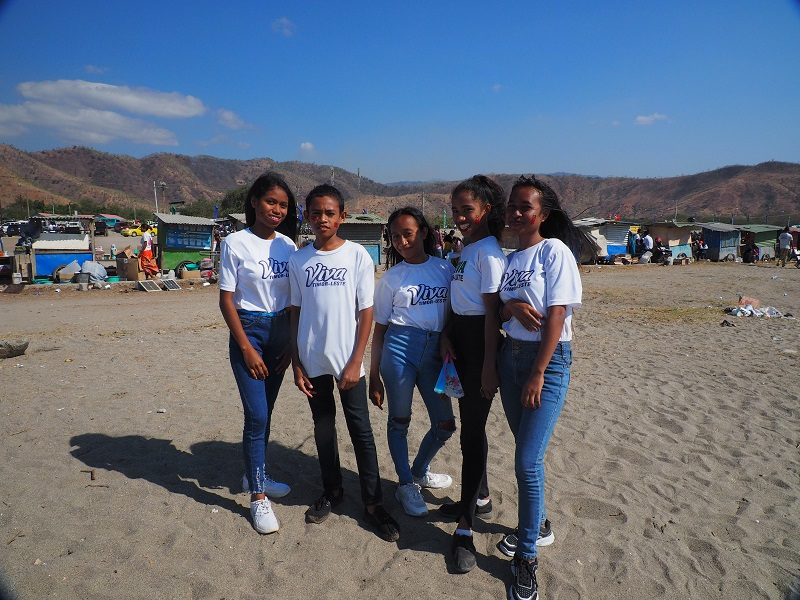

A lot of the time I get a quizzical look when I say my research is in Timor-Leste. Sometimes, a few seconds of thought gives an “Oh… EAST Timor” response, but a good chunk of people have never heard of the place. Which is understandable, as it is a tiny nation of 1.3 million people encompassing half of Timor Island and has been formally a country less time than I have been alive. Timor-Leste is still officially a teenager with its independence in 2002. With the 20 year anniversary of the referendum popular consultation for independence, I thought I would briefly outline Timor-Leste’s history.

PIC: flyover

Honestly, other than a basic timeline I did not have a good understanding of Timor-Leste’s history until doing a tour in the capital of Dili. The Portuguese colonized Timor in the 1500s when it was a global superpower. Prior to colonization, Timor Island was comprised of various tribes. Like most colonial powers at the time, Portugal was primarily interested in the unspoiled resources of the island like sandalwood and they did a good job of clearing it out. I do not think there is any sandalwood left in Timor to this day.

Timor-Leste was a Portuguese colony until a military coup back in Portugal in November 28, 1975. Even during Timor’s time as a Portuguese colony, the indigenous population was marginalized. It had never occurred to me that the Timorese had been poorly treated through limited education etc. long before the Indonesian occupation even though discrimination of the native population was standard for colonizers. The independence was short-lived, however, when the Indonesians marched in nine days later.

The international community was aware of Indonesia’s plans to annex Timor-Leste. With the red-scare raging at the time, Indonesia’s control over Timor-Leste was favored by the US and supported with US equipment. Australia did not believe the Timorese had the capacity to govern themselves and many of the other world powers such as Japan, Russia, France, did nothing. 

As a former Portuguese colony, the Timorese are culturally very different than Indonesia with a large majority of the population following the Catholic Church. The Indonesians were ruthless in Timor-Leste. An estimated 100,000 to 300,000 Timorese died during the Indonesian occupation from starvation and violence. The violence was not only from the Indonesians, but also internal Timorese parties such as pro-independence, pro-autonomy, and pro-Portuguese parties vying for power in the resistance. 

In 1989, Pope John Francis the VI visited Timor-Leste and delivered mass from Tasi Tolu. Pope Francis was the only international dignitary to visit Timor-Leste during the Indonesian occupation. His visit served to shed light on the humanitarian crisis in Timor-Leste.

A few years later in 1991, a young activist named Sebastian Gomes was shot outside Motael Church trying to seek shelter from Indonesian forces. His funeral on the 12th of November became a pro-independence protest which led to the Santa Cruz Massacre in Santa Cruz Cemetery where he was buried. The Indonesian army open-fired on the crowd in the cemetary and about 250 Timorese were killed. British journalist Max Stahl was present filming the atrocity. The film was smuggled from the country and aired internationally which enlightened the world to the ongoing humanitarian crisis in Timor-Leste. In 1996, two Timorese, Jose Ramos-Hortas and Bishop Carlos Filipe Ximenes Belo, were awarded the Nobel Peace Prize for their efforts campaigning for independence to the United Nations.

The United Nations oversaw the independence referendum to determine either special autonomy within Indonesia or independence for Timor-Leste in 1999. The results were overwhelmingly in favor of independence with 78.5% of the population pro-independence. Following the announcement of the result, there was another wave of violence where approximately 2,000 people were killed. Official independence was achieved in 2002.

The influence of Timorese history as a Portuguese colony and Indonesian province is prominent throughout Timorese culture today. Portuguese is an official language along with Tetun and most of the population speaks Bahasa Indonesia. Even the Timorese youths learn some Bahasa through the Indonesian influence of tv. The food is Indonesian influenced with pisang gorent, tempeh, and bakso common on the streets, but also with good, European-style bread that backers coming through Southeast Asia very much appreciate. Portuguese names are very common. You meet many a Jose, Mario, Maria, Inacia in Timor. The Timorese love singing and dancing, everyone, that is, except my Tetun teacher. 

Hopefully, the future is bright for this young country. Tourism is slated to be Timor-Leste’s main non-petroleum industry, yet at this point only the most adventurous travelers come to Timor. Let’s see what the future holds.

